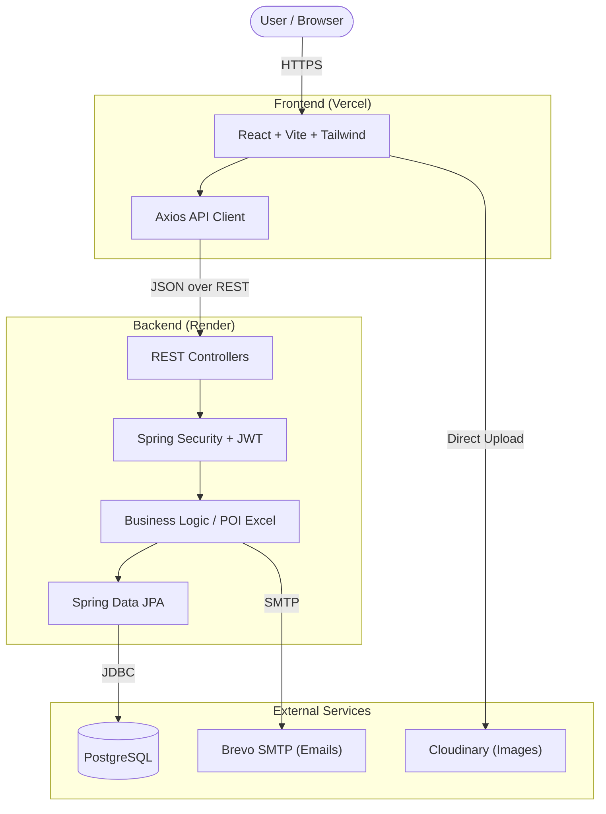

<h1 align="center">
  Money Manager
</h1>

<p align="center">
  A full-stack personal finance management platform for tracking income, expenses, categories, financial trends, and transaction history through a modern dashboard.
</p>

<p align="center">
  <a href="https://money-manager-seven-tawny.vercel.app"><strong>Live Frontend (Vercel)</strong></a> · 
  <a href="https://money-manager-0s4k.onrender.com/api/v1.0/status"><strong>Live Backend API (Render)</strong></a>
</p>

<p align="center">
  
  
  
  
  
  
  
</p>

---

## 📖 Table of Contents

- [Overview](#-overview)
- [Architecture](#-architecture)
- [Tech Stack](#-tech-stack)
- [Features](#-features)
- [Screenshots](#-screenshots)
- [Data Flow & API](#-data-flow--api)
- [Local Setup](#-local-setup)
- [Environment Variables](#-environment-variables)
- [Deployment](#-deployment)
- [Technical Highlights](#-technical-highlights)
- [Future Enhancements](#-future-enhancements)

---

## 🎯 Overview

**Money Manager** is a complete, production-ready financial tracking application. It solves the problem of personal budget fragmentation by providing a single, unified interface to record transactions, categorize spending, and visualize cash flow. 

Users can register securely, categorize their income and expenses, apply complex date/keyword filters, and export their transaction history to Excel or directly via email. It is designed with a premium, responsive UI and backed by a robust Java Spring Boot REST API.

---

## 🏗 Architecture



---

## 💻 Tech Stack

### Frontend
- **React (Vite)**: Fast component-driven UI
- **Tailwind CSS**: Utility-first styling for a custom, premium design system
- **Recharts**: Interactive financial data visualization (Pie & Line charts)
- **Axios**: Configured with interceptors for seamless JWT injection and 403 handling
- **Lucide React**: Modern iconography
- **Moment.js**: Date parsing and formatting
- **React Hot Toast**: Toast notifications for error and success states
- **Emoji Picker React**: Custom icon selection for categories and transactions

### Backend
- **Java 25**: Core programming language
- **Spring Boot**: REST API framework
- **Spring Security & JWT**: Stateless token-based authentication
- **Spring Data JPA (Hibernate)**: ORM for database mapping
- **Apache POI**: Dynamic Excel (`.xlsx`) generation
- **JavaMailSender**: For account activation links and financial reports
- **MySQL / PostgreSQL**: Relational database persistence

---

## ✨ Features

### 🔐 Authentication & Security
- Secure registration and login flow.
- Passwords hashed using BCrypt.
- Stateless JWT-based authentication.
- Email verification via activation links before login is permitted.

### 📊 Dashboard & Visualization
- Real-time calculation of Total Balance, Income, and Expenses.
- **Finance Overview:** Interactive Pie Charts breaking down spending by category.
- **Trend Analysis:** Line charts mapping income vs. expense over time.
- Empty states and loading skeletons designed to prevent UI flickering.

### 💰 Transaction Management (Income & Expense)
- Add and delete individual transactions.
- Assign dates, amounts, custom names, and emoji-based icons.
- **Export & Email:** Generate `.xlsx` Excel spreadsheets of your filtered transactions and download them or email them directly to your registered inbox.

### 📁 Category Management
- Pre-loaded default categories mapped by transaction type.
- Create custom categories to granularly track niche expenses/income.

### 🔍 Advanced Filtering
- Multi-dimensional filtering by:
  - Transaction Type (Income/Expense)
  - Date Ranges (Start Date to End Date)
  - Keyword search
  - Dynamic Sorting (Date, Amount, Name in ASC/DESC)

---

## 🖼 Screenshots

*(Placeholders for screenshots - Add images to a `docs/` folder and link them here)*

| Dashboard | Login / Registration |
|:---:|:---:|
| `` | `` |
| **Income / Expense Tracking** | **Excel Exports** |
| `` | `` |

---

## 📡 Data Flow & API

The backend exposes a highly structured REST API located under `/api/v1.0`.

### Interceptors & Tokens
The frontend utilizes a centralized `AxiosConfig.js`. 
- **Request Interceptor**: Automatically attaches the `Bearer <token>` to all protected routes (ignoring `/login`, `/register`, `/activate`, `/health`).
- **Response Interceptor**: Catches `403 Forbidden` statuses globally to forcefully log out and redirect users whose sessions have expired.

### Key API Endpoints
- `POST /api/v1.0/register` & `POST /api/v1.0/login`
- `GET /api/v1.0/dashboard` - Aggregates stats, charts, and recent transactions.
- `GET/POST/DELETE /api/v1.0/incomes` & `/api/v1.0/expenses`
- `GET /api/v1.0/excel/download/income` & `expense`
- `POST /api/v1.0/email/income` & `expense`

---

## 🚀 Local Setup

### Prerequisites
- Node.js (v18+)
- Java 25 (Eclipse Temurin or similar)
- Maven
- MySQL or PostgreSQL running locally

### 1. Clone Repository
```bash
git clone https://github.com/yourusername/money-manager.git
cd money-manager
```

### 2. Backend Setup
```bash
cd moneymanager
# Copy example env and fill in your local database credentials
cp .env.example .env
```
Run the application using the Maven wrapper:
```bash
./mvnw spring-boot:run
```
*Backend runs on `http://localhost:8083`*

### 3. Frontend Setup
```bash
cd ../money-manager-frontend
# Copy example env and configure
cp .env.example .env
npm install
npm run dev
```
*Frontend runs on `http://localhost:5173`*

---

## 🔐 Environment Variables

Ensure the following variables are configured in your production environments. Do **not** commit real `.env` files to Git.

### Frontend (`.env`)
```env
VITE_BASE_URL=http://localhost:8083/api/v1.0
VITE_CLOUDINARY_CLOUD_NAME=your_cloudinary_name
```

### Backend (`.env` or Server Environment)
```env
DB_URL=jdbc:mysql://localhost:3306/moneymanager
DB_USERNAME=root
DB_PASSWORD=secret
JWT_SECRET=your_super_secret_jwt_key
FROM_EMAIL=noreply@yourdomain.com
BRAVO_USERNAME=smtp_username
BRAVO_PASSWORD=smtp_password
FRONTEND_URL=http://localhost:5173
MONEY_MANAGER_BACKEND_URL=http://localhost:8083
```

---

## 🌍 Deployment

### Frontend (Vercel)
1. Connect the GitHub repository to Vercel.
2. Set the Root Directory to `money-manager-frontend`.
3. Add `VITE_BASE_URL` and `VITE_CLOUDINARY_CLOUD_NAME` to the Vercel Environment Variables.
4. Deploy. Vercel automatically detects the Vite build commands.

### Backend (Render)
1. Connect the GitHub repository to Render (Web Service).
2. Set the Root Directory to `moneymanager`.
3. **Build Command**: `chmod +x mvnw && ./mvnw clean package -DskipTests`
4. **Start Command**: `java -jar target/moneymanager-0.0.1-SNAPSHOT.jar`
5. Add all required Database, JWT, and SMTP Environment Variables.

---

## 🧠 Technical Highlights

- **Anti-Flicker Architecture**: Frontend UI implements React `useRef` locks and strict loading states to prevent empty-state flashing and duplicate API calls in React Strict Mode.
- **Robust Exception Handling**: Global Axios response interceptors cleanly parse backend exception messages (e.g. replacing raw "Network Error" with human-readable UI toasts).
- **Stateless & Scalable**: Pure JWT implementation means the backend scales horizontally without needing sticky sessions or distributed caches.
- **Containerized Build**: Optimized Dockerfile utilizing multi-stage builds (JDK for compiling, JRE for execution) resulting in a slim production image.

---

## 🔮 Future Enhancements

- Multi-currency support and real-time exchange rates.
- Shared budgets for family/team collaboration.
- Automated recurring transactions.
- OAuth2 integration (Google/GitHub login).

---

*Designed and developed by [Purna Koppadi]*
